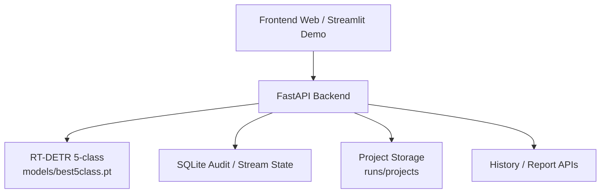

# Ứng dụng mô hình RT-DETR trong bài toán phát hiện và phân loại lỗi hư hỏng bề mặt công trình

[](#)
[](https://www.python.org/)
[](https://pytorch.org/)
[](https://github.com/lyuwenyu/RT-DETR)
[](https://fastapi.tiangolo.com/)
[](https://git-lfs.com/)


## 1. Giới thiệu

Đề tài tập trung nghiên cứu, xây dựng và triển khai một hệ thống hỗ trợ phát hiện lỗi hư hỏng bề mặt công trình, trong đó trọng tâm là các dạng vết nứt và ổ gà trên bề mặt đường bộ. Bài toán này có ý nghĩa thực tiễn cao trong kiểm tra hiện trạng, giám sát an toàn kết cấu, lập kế hoạch bảo trì và hỗ trợ đánh giá nhanh tại hiện trường.

Khác với các hướng tiếp cận chỉ dừng ở mức thử nghiệm mô hình, dự án này phát triển theo hướng hoàn chỉnh hơn: từ huấn luyện mô hình nhận diện đa lớp, xây dựng API suy luận, giao diện web phục vụ thao tác thực tế, đến cơ chế lưu lịch sử theo dự án và xuất báo cáo kỹ thuật.

Mô hình cốt lõi được lựa chọn là **RT-DETR (Real-Time Detection Transformer)**, một kiến trúc phát hiện đối tượng theo hướng **end-to-end**, có khả năng tận dụng ngữ cảnh toàn cục thông qua cơ chế **self-attention**, đồng thời loại bỏ nhu cầu sử dụng **Non-Maximum Suppression (NMS)** trong suy luận cuối.

## 2. Thông tin đề tài

- **Tên đề tài:** Ứng dụng mô hình mạng Transformer (RT-DETR) trong bài toán nhận diện và phân loại lỗi hư hỏng bề mặt đường bộ
- **Lĩnh vực:** Thị giác máy tính, Học sâu, Hệ hỗ trợ kiểm tra công trình
- **Công nghệ sử dụng:** Python, PyTorch, Ultralytics, RT-DETR, OpenCV, FastAPI, Streamlit, Kaggle, SQLite
- **Tác giả:** Ngô Minh (GitHub: `Ngo-Miingg`)
- **Giảng viên hướng dẫn:** Đang cập nhật theo hồ sơ nghiên cứu chính thức
- **Mô hình triển khai chính:** `models/best5class.pt`
- **Cấu hình lớp dữ liệu:** [`configs/dataset5class.yaml`](configs/dataset5class.yaml)

## 3. Mục tiêu nghiên cứu

- Xây dựng mô hình phát hiện và phân loại lỗi hư hỏng bề mặt công trình theo hướng đa lớp.
- Đánh giá tính khả thi của RT-DETR đối với dữ liệu có cấu trúc phức tạp, nền nhiễu và đối tượng mảnh.
- Triển khai hệ thống suy luận có khả năng hoạt động trên ảnh tải lên, camera chụp nhanh và luồng stream.
- Tổ chức đầu vào, đầu ra và lịch sử phân tích theo từng dự án nhằm phục vụ lưu trữ và trưng bày kết quả nghiên cứu.

## 4. Đối tượng nhận diện

Hệ thống hiện hỗ trợ **05 lớp hư hỏng**:

| ID | Tên lớp (Tiếng Việt) | Tên lớp gốc |
|---|---|---|
| 0 | Vết nứt dọc | `longitudinal crack` |
| 1 | Vết nứt ngang | `transverse crack` |
| 2 | Nứt da cá sấu | `alligator crack` |
| 3 | Hư hỏng khác | `other corruption` |
| 4 | Ổ gà | `pothole` |

## 5. Điểm nổi bật của hệ thống

- Sử dụng mô hình **RT-DETR 5 lớp** để nhận diện lỗi hư hỏng bề mặt theo hướng end-to-end.
- Có giao diện web trực quan, cho phép phân tích ảnh và theo dõi lịch sử kiểm tra theo **dự án**.
- Hỗ trợ **stream mode**, lưu tóm tắt phiên làm việc và xuất báo cáo kỹ thuật.
- Duy trì pipeline triển khai gần với điều kiện ứng dụng thực tế: API, lưu ảnh đầu vào/đầu ra, audit log và dữ liệu lịch sử.
- Sử dụng **Git LFS** để quản lý trọng số mô hình, phù hợp cho lưu trữ và trình bày trên GitHub.

## 6. Kết quả chính

Kết quả nghiệm thu nội bộ cho thấy mô hình đạt chất lượng ở mức khả quan đối với bài toán nhận diện đa lớp trên nền dữ liệu khó:

| Chỉ số | Giá trị | Ghi chú |
|---|---:|---|
| mAP@0.5 tổng thể | 0.738 | Kết quả nghiệm thu trên mô hình RT-DETR 5 lớp |
| F1-Score tốt nhất | 0.750 | Tại ngưỡng confidence `0.485` |
| Tốc độ suy luận | ~20 ms/ảnh | Đáp ứng định hướng gần thời gian thực |
| Lớp tốt nhất | `other corruption` - mAP 0.820 | Hưởng lợi rõ từ ngữ cảnh toàn cục |
| Lớp tốt thứ hai | `alligator crack` - mAP 0.765 | Nhận diện tốt cấu trúc vùng rộng |
| Lớp khó nhất | `transverse crack` - mAP 0.650 | Dễ nhầm với nền và kết cấu bề mặt |

## 7. Bảng đánh giá tóm tắt

| Thành phần đánh giá | Giá trị hiện có | Nhận xét |
|---|---:|---|
| Precision | Đang cập nhật | Sẽ chốt theo bảng nghiệm thu cuối cùng của đề tài |
| Recall | Đang cập nhật | Sẽ chốt theo bảng nghiệm thu cuối cùng của đề tài |
| mAP@0.5 | 0.738 | Mức hiệu năng khá tốt đối với bài toán đa lớp nhiều nhiễu nền |
| F1 tối ưu | 0.750 | Hỗ trợ chọn ngưỡng vận hành ổn định |
| Thời gian suy luận | ~20 ms/ảnh | Phù hợp cho demo web và stream mức cơ bản |

## 8. Minh họa hệ thống

### 8.1. Ảnh demo giao diện


### 8.2. Ảnh demo chế độ stream


### 8.3. Tóm tắt khả năng trình diễn

- Giao diện web hỗ trợ phân tích ảnh tĩnh, camera chụp nhanh và stream theo phiên làm việc.
- Kết quả được lưu theo dự án, có thể truy xuất ảnh đầu vào, ảnh đầu ra và lịch sử phân tích.
- Phù hợp để trưng bày mã nguồn nghiên cứu, demo nội bộ và phát triển tiếp thành hệ thống hỗ trợ kiểm tra hiện trường.

## 9. Kiến trúc hệ thống

Luồng xử lý tổng quát của hệ thống:

1. Ảnh đầu vào được tiếp nhận từ người dùng qua giao diện web hoặc API.
2. Ảnh được tiền xử lý và chuẩn hóa theo cấu hình runtime.
3. Mô hình RT-DETR thực hiện suy luận và sinh ra danh sách đối tượng phát hiện.
4. Kết quả được hậu xử lý, tổng hợp theo lớp, đánh giá mức độ hư hỏng và lưu về thư mục dự án.
5. Hệ thống ghi nhận lịch sử phân tích, hỗ trợ truy xuất ảnh đầu vào, ảnh đầu ra và báo cáo phiên làm việc.

Biểu diễn kiến trúc mức mã nguồn:



## 10. Cấu trúc thư mục dự án

```text
rtdetr_rddsplit_demo/
├── backend/
│   └── app.py
├── configs/
│   └── dataset5class.yaml
├── demo/
│   └── app_streamlit.py
├── frontend/
│   ├── index.html
│   ├── script.js
│   ├── style.css
│   └── logo.jpg
├── images/
│   ├── BoxPR_curve.png
│   ├── confusion_matrix_normalized.png
│   ├── stream.png
│   └── trangchu.png
├── models/
│   ├── .gitkeep
│   └── best5class.pt
├── notebooks/
│   ├── kaggle_rdd2022_optimize_and_train.ipynb
│   ├── kaggle_rtdetr5class_acceptance_audit.ipynb
│   └── ...
├── scripts/
│   └── check_project.py
├── .env.example
├── .gitattributes
├── .gitignore
├── Makefile
├── README.md
└── requirements.txt
```

## 11. Hướng dẫn cài đặt và sử dụng

### 11.1. Clone mã nguồn

```bash
git clone https://github.com/Ngo-Miingg/Construction_site_cracks.git
cd Construction_site_cracks
```

### 11.2. Tải trọng số mô hình bằng Git LFS

```bash
git lfs install
git lfs pull
```

### 11.3. Tạo môi trường và cài đặt thư viện

#### Windows

```bat
py -3.11 -m venv .venv
.\.venv\Scripts\python -m pip install --upgrade pip
.\.venv\Scripts\python -m pip install -r requirements.txt
```

#### Linux/macOS

```bash
python -m venv .venv
source .venv/bin/activate
pip install --upgrade pip
pip install -r requirements.txt
```

### 11.4. Kiểm tra nhanh trước khi chạy

```bash
python scripts/check_project.py
python -m py_compile backend/app.py demo/app_streamlit.py
```

Nếu máy đã cài `make`:

```bash
make check-project
```

### 11.5. Chạy hệ thống Web/API

```bash
python -m uvicorn backend.app:app --host 0.0.0.0 --port 8000 --reload
```

Sau khi khởi động, truy cập:

```text
http://127.0.0.1:8000
```

### 11.6. Chạy bản demo Streamlit

```bash
streamlit run demo/app_streamlit.py
```

## 12. Hướng dẫn sử dụng nhanh

### 12.1. Phân tích ảnh qua giao diện

1. Mở giao diện web tại `http://127.0.0.1:8000`.
2. Tạo hoặc chọn dự án cần lưu trữ kết quả.
3. Tải ảnh lên hoặc chụp ảnh trực tiếp.
4. Hệ thống trả về danh sách đối tượng phát hiện, ảnh đầu ra và lịch sử kiểm tra.

### 12.2. Phân tích qua API

#### Kiểm tra trạng thái hệ thống

```bash
curl http://127.0.0.1:8000/api/health
```

#### Gửi ảnh phân tích cơ bản

```bash
curl -X POST "http://127.0.0.1:8000/api/analyze/basic" \
  -F "file=@sample.jpg" \
  -F "conf=0.25" \
  -F "iou=0.6" \
  -F "imgsz=640"
```

PowerShell:

```powershell
curl.exe -X POST "http://127.0.0.1:8000/api/analyze/basic" `
  -F "file=@sample.jpg" `
  -F "conf=0.25" `
  -F "iou=0.6" `
  -F "imgsz=640"
```

#### Gửi ảnh phân tích chuyên sâu

```bash
curl -X POST "http://127.0.0.1:8000/api/analyze/deep" \
  -F "file=@sample.jpg" \
  -F "conf=0.25" \
  -F "iou=0.6" \
  -F "imgsz=640"
```

PowerShell:

```powershell
curl.exe -X POST "http://127.0.0.1:8000/api/analyze/deep" `
  -F "file=@sample.jpg" `
  -F "conf=0.25" `
  -F "iou=0.6" `
  -F "imgsz=640"
```

## 13. Các API chính

| Nhóm API | Endpoint tiêu biểu | Mục đích |
|---|---|---|
| Health | `GET /api/health` | Kiểm tra trạng thái hệ thống và mô hình |
| Phân tích | `POST /api/analyze/basic`, `POST /api/analyze/deep` | Suy luận ảnh đầu vào |
| Dự án | `GET /api/projects`, `POST /api/projects` | Quản lý không gian lưu trữ theo dự án |
| Lịch sử | `GET /api/history` | Truy xuất các lần phân tích trước |
| Stream | `POST /api/stream/session/start` | Khởi tạo phiên giám sát thời gian thực |
| Audit | `GET /api/audit/events` | Theo dõi sự kiện vận hành hệ thống |

## 14. Môi trường và phụ thuộc

Các thư viện chính được khai báo trong [`requirements.txt`](requirements.txt):

- `ultralytics`
- `opencv-python`
- `numpy`
- `pyyaml`
- `fastapi`
- `uvicorn[standard]`
- `streamlit`
- `python-multipart`

## 15. Biểu đồ kỹ thuật tham khảo

### Precision-Recall Curve


### Confusion Matrix (Normalized)


Hai biểu đồ trên được giữ lại trực tiếp trong repository để người xem có thể đánh giá nhanh chất lượng mô hình ngay trên GitHub mà không cần mở thêm báo cáo ngoài.

## 16. Hạn chế hiện tại

- Hiệu năng giữa các lớp chưa đồng đều, đặc biệt lớp **vết nứt ngang** vẫn còn nhạy với nền nhiễu.
- Kết quả phụ thuộc đáng kể vào chất lượng ảnh đầu vào, ánh sáng và góc chụp hiện trường.
- README hiện để trống một số trường học thuật như thông tin tác giả, giảng viên hướng dẫn và banner chính thức để thuận tiện cho việc cập nhật sau này.

## 17. Hướng phát triển

- Mở rộng bộ dữ liệu theo nhiều điều kiện ánh sáng, góc nhìn và bề mặt vật liệu khác nhau.
- Bổ sung quy trình nghiệm thu đầy đủ hơn cho Precision, Recall và phân tích sai số theo lớp.
- Tinh chỉnh kiến trúc backbone hoặc chiến lược tiền xử lý để cải thiện các đối tượng mảnh, kích thước nhỏ.
- Xuất báo cáo tự động theo mẫu nghiệm thu nghiên cứu khoa học hoặc đồ án tốt nghiệp.
- Đóng gói hệ thống theo hướng demo triển lãm hoặc triển khai thực tế quy mô nhỏ.

## 18. Thông tin tác giả và giảng viên hướng dẫn

| Vai trò | Thông tin |
|---|---|
| Tác giả | Ngô Minh - GitHub: `Ngo-Miingg` |
| Giảng viên hướng dẫn | Đang cập nhật theo hồ sơ chính thức |
| Đơn vị | Đang cập nhật |
| Năm thực hiện | `2025 - 2026` |

## 19. Trích dẫn dự án

Nếu sử dụng mã nguồn, cấu trúc hệ thống hoặc kết quả nghiên cứu từ repository này, vui lòng trích dẫn theo định dạng sau:

```bibtex
@misc{rtdetr_surface_damage_2026,
  title        = {Ứng dụng mô hình RT-DETR trong bài toán phát hiện và phân loại lỗi hư hỏng bề mặt công trình},
  author       = {Ngo Minh},
  year         = {2026},
  howpublished = {GitHub Repository},
  note         = {Research project source code and deployment prototype}
}
```

## 20. Tài liệu tham khảo

1. Carion, N., Massa, F., Synnaeve, G., Usunier, N., Kirillov, A., & Zagoruyko, S. (2020). *End-to-End Object Detection with Transformers*. ECCV.
2. Lv, W., Xu, S., Zhao, Y., Wang, G., Wei, P., Cui, C., Deng, Y., Du, M., & Qiao, Y. (2023). *DETRs Beat YOLOs on Real-time Object Detection*. CVPR.
3. Vaswani, A., Shazeer, N., Parmar, N., Uszkoreit, J., Jones, L., Gomez, A. N., Kaiser, L., & Polosukhin, I. (2017). *Attention Is All You Need*. NeurIPS.
4. He, K., Zhang, X., Ren, S., & Sun, J. (2016). *Deep Residual Learning for Image Recognition*. CVPR.
5. Lin, T.-Y., Goyal, P., Girshick, R., He, K., & Dollar, P. (2017). *Focal Loss for Dense Object Detection*. ICCV.

## 21. Ghi chú khi đưa lên GitHub

- Trọng số mô hình `best5class.pt` được quản lý bằng **Git LFS**.
- Các file `.docx`, ảnh công thức sinh tự động và artifact runtime được loại khỏi commit để lịch sử repository gọn hơn.
- Trước khi push, nên chạy:

```bash
git status
python scripts/check_project.py
```
