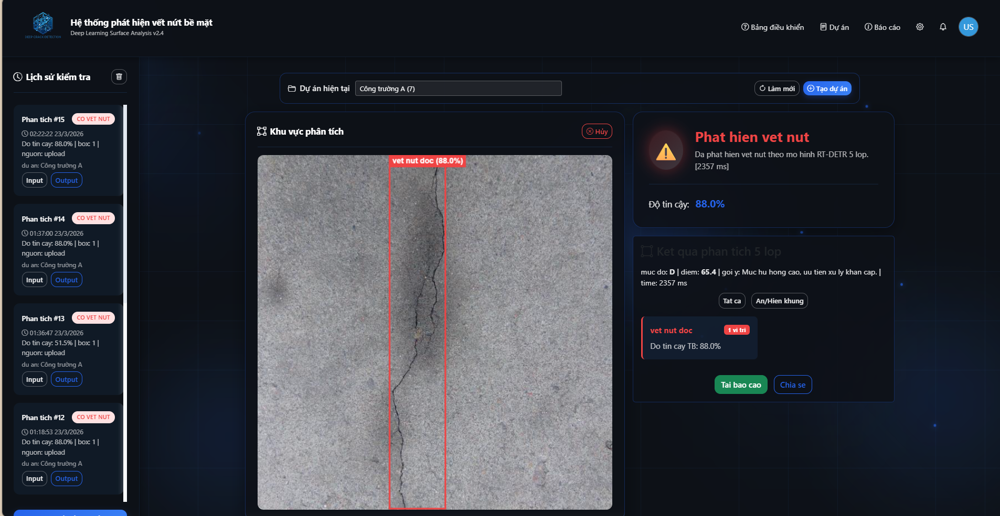
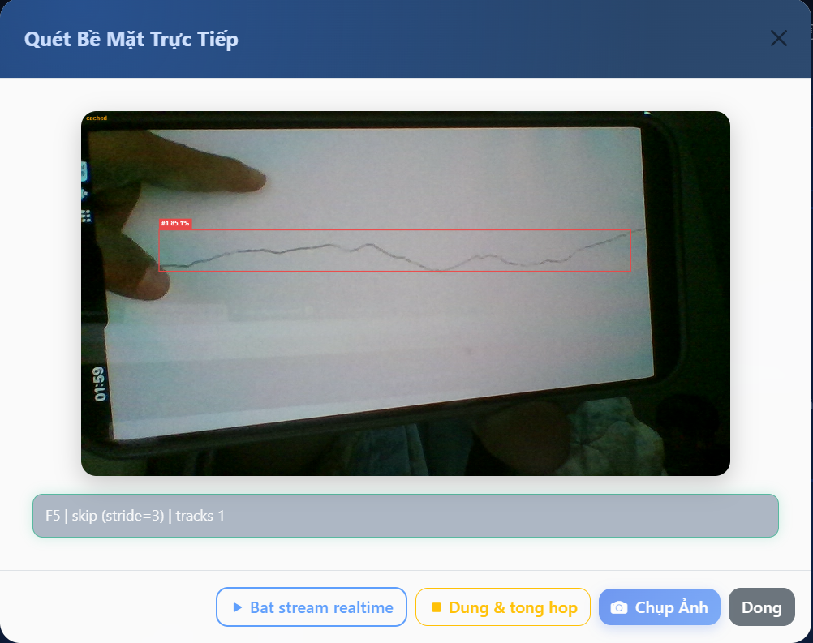
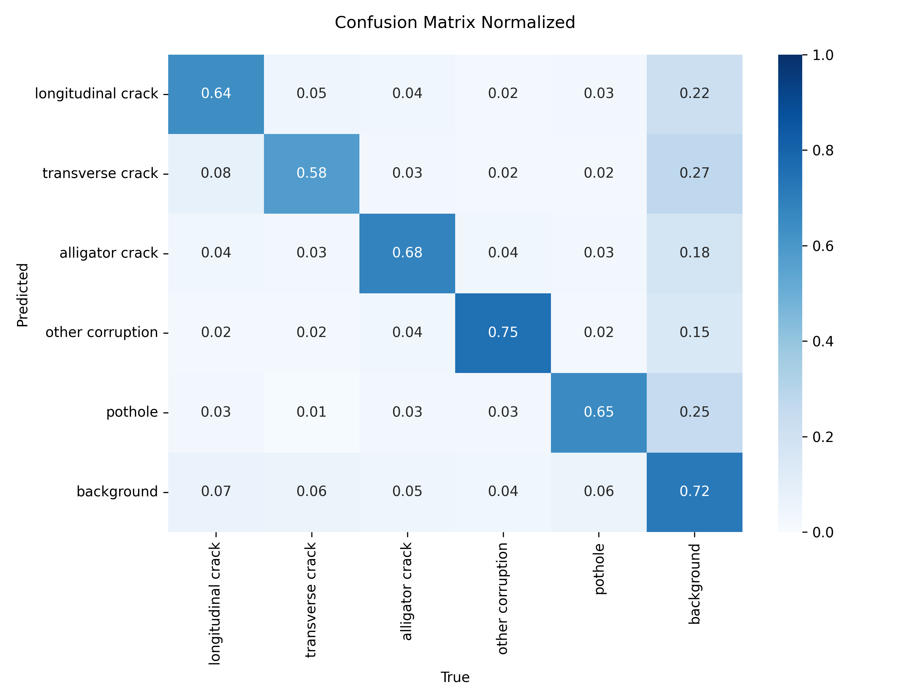
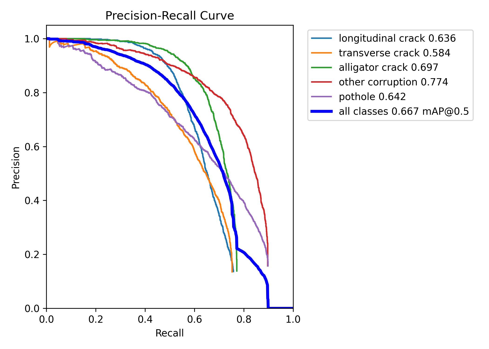

# He thong phat hien vet nut be mat cong truong (RT-DETR 5-class)

[](https://www.python.org/)
[](https://fastapi.tiangolo.com/)
[](https://github.com/ultralytics/ultralytics)
[](https://git-lfs.com/)

Du an web + API phuc vu detect vet nut mat duong/be mat cong truong theo **5 lop hu hong** bang **RT-DETR**.  
Ban hien tai da toi gian ve 1 pipeline: chi dung **model 5-class** (`models/best5class.pt`).

---

## 1) Giao dien thuc te

### Trang chinh


### Che do stream realtime + tong hop doan nghi ngo


---

## 2) Bai toan va muc tieu

- Detect vet nut/hong mat duong tu anh upload, camera va stream.
- To chuc du lieu theo **du an** (project) de quan ly nhap/xuat va lich su.
- Cung cap API de tich hop voi he thong nghiem thu/bao cao.
- Sinh tong hop stream: candidate frame, segment, risk level, report JSON/ZIP.

---

## 3) 5 lop hu hong ho tro

| Class ID | Ten class (VI) | Ten class (raw) |
|---|---|---|
| 0 | vet nut doc | longitudinal crack |
| 1 | vet nut ngang | transverse crack |
| 2 | nut da ca sau | alligator crack |
| 3 | hu hong khac | other corruption |
| 4 | o ga | pothole |

Dataset mapping: `configs/dataset5class.yaml`

---

## 4) Kha nang chinh

- **Detect 5-class** (RT-DETR) tren anh upload/capture.
- **Realtime stream mode**:
  - frame stride de giam tai
  - tracking ID nhe tren overlay
  - candidate-hit + segment summary
  - de xuat frame uu tien quet sau
- **Project-based workflow**:
  - tao/chon du an
  - luu artifact input/output theo du an
  - xem lich su phan tich
- **Bao cao**:
  - report JSON
  - bundle ZIP (json + csv summary)
- **Audit log** sqlite cho cac su kien stream/report.

---

## 5) Kien truc tong quan

```text
Frontend (HTML/CSS/JS)  <->  FastAPI (backend/app.py)  <->  RT-DETR model (best5class.pt)
                                      |
                                      +-- SQLite (history, stream sessions, audit)
                                      +-- Storage artifact theo project
```

---

## 6) Cau truc thu muc

```text
backend/
  app.py                 # FastAPI service + infer + stream + history/audit
frontend/
  index.html             # UI
  script.js              # luong upload/camera/stream
  style.css              # giao dien
configs/
  dataset5class.yaml     # class names 5 lop
models/
  best5class.pt          # model RT-DETR 5-class (Git LFS)
demo/
  app_streamlit.py       # demo Streamlit (5-class only)
images/                  # anh minh hoa README (UI/metrics)
```

---

## 7) Cai dat nhanh

## 7.1 Windows (khuyen nghi)

```bat
cd /d D:\NCKH_25-26\rtdetr_rddsplit_demo

git lfs install
git lfs pull

if not exist .venv\Scripts\python.exe py -3.11 -m venv .venv
.\.venv\Scripts\python -m pip install --upgrade pip
.\.venv\Scripts\python -m pip install -r requirements.txt

.\.venv\Scripts\python -m uvicorn backend.app:app --host 0.0.0.0 --port 8000 --reload
```

Mo trinh duyet: `http://127.0.0.1:8000`

## 7.2 Linux/macOS

```bash
git lfs install
git lfs pull

python -m venv .venv
source .venv/bin/activate
pip install -U pip
pip install -r requirements.txt

python -m uvicorn backend.app:app --host 0.0.0.0 --port 8000 --reload
```

---

## 8) Model weights (Git LFS)

File model duoc quan ly boi Git LFS:

- `models/best5class.pt`

Sau khi clone repo, bat buoc chay:

```bash
git lfs install
git lfs pull
```

---

## 9) Kiem tra nhanh truoc khi chay

```bash
python -m py_compile backend/app.py demo/app_streamlit.py
```

Neu may co `make`:

```bash
make check-project
```

---

## 10) API chinh

### Health / Infer
- `GET /api/health`
- `POST /api/analyze/basic`
- `POST /api/analyze/deep`

### Project / History
- `GET /api/projects`
- `POST /api/projects`
- `GET /api/history`
- `DELETE /api/history`
- `GET /api/history/{history_id}/artifact/{kind}`

### Stream
- `POST /api/stream/session/start`
- `POST /api/stream/frame/basic`
- `GET /api/stream/session/{session_id}/summary`
- `GET /api/stream/session/{session_id}/report`
- `GET /api/stream/session/{session_id}/report/bundle`
- `POST /api/stream/session/{session_id}/reset`
- `DELETE /api/stream/session/{session_id}`

### Audit
- `GET /api/audit/events`

---

## 11) Input infer (form-data)

Endpoint `basic` va `deep` nhan cac truong:

- `file`
- `conf` (default `0.25`)
- `iou` (default `0.6`)
- `imgsz` (default `640`)
- `device` (`auto` mac dinh)
- `input_source` (`upload|camera|stream`)
- `scene` (`auto|default|near|far|night`)

---

## 12) Luong stream de su dung trong san pham

1. Tao session: `POST /api/stream/session/start`
2. Gui frame: `POST /api/stream/frame/basic`
3. Doc tong hop doan nghi ngo: `GET /api/stream/session/{session_id}/summary`
4. Quet sau frame uu tien bang deep infer (neu can)
5. Xuat report:
   - JSON: `/report`
   - ZIP bundle: `/report/bundle`

---

## 13) Bieu do danh gia mau (tu qua trinh train)

> Cac bieu do duoi day la artifact ky thuat tham khao de theo doi chat luong model.

### Confusion matrix (normalized)


### PR Curve


---

## 14) Bien moi truong quan trong

Xem file `.env.example`, cac nhom quan trong:

- **Model/Data path**: `MODEL_5CLASS_PATH`, `MODEL_DEEP_PATH`, `DATASET5_YAML_PATH`
- **Storage**: `PROJECT_STORAGE_ROOT`, `STREAM_STATE_DB_PATH`
- **Infer threshold**: `BASIC_*`, `DEEP_*`
- **Stream policy**: `STREAM_*`
- **Audit**: `AUDIT_LOG_ENABLE`, `AUDIT_DB_MAX_EVENTS`
- **Preprocess**: `PREPROCESS_*`

---

## 15) Ghi chu van hanh

- Neu `uvicorn` khong duoc nhan dien, hay chay qua python module:
  - `python -m uvicorn backend.app:app --host 0.0.0.0 --port 8000 --reload`
- Neu clone moi ma khong thay model:
  - `git lfs pull`
- Neu thay doi weight:
  - dat dung ten/duong dan trong `models/` hoac env vars.

---

## 16) Huong phat trien tiep

- Them auth + role cho API.
- Export bao cao PDF theo mau nghiem thu.
- Them queue/batch infer cho camera fleet.
- Dashboard thong ke theo du an/thoi gian.

---
